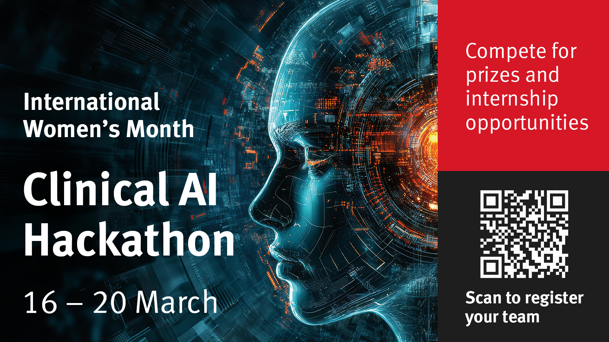
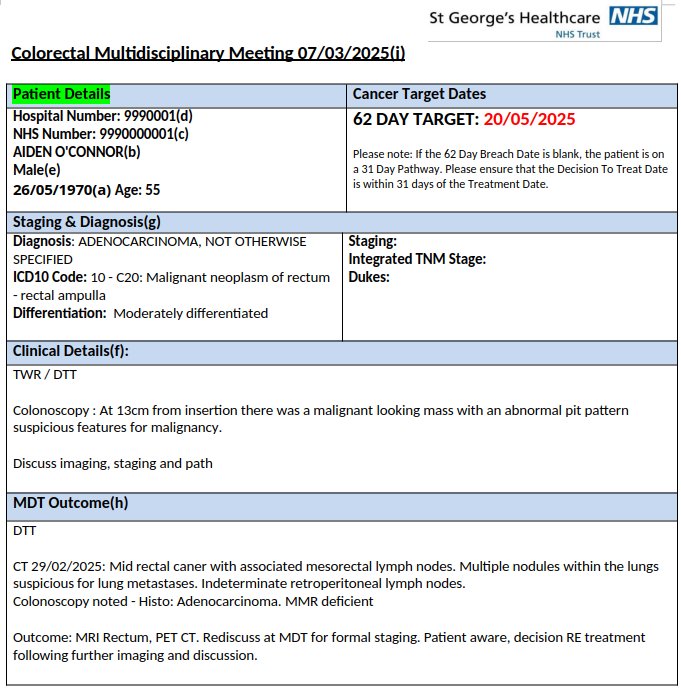
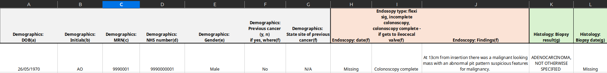

## Problem Statement - by Dr Anita Wale

So this is the clinical problem: 

We discuss patients with cancer in weekly meetings call multidisciplinary team meetings - MDTs. These consist of core members which cover the cancer treatment pathway, their initiation years ago have been one of the reasons cancer survival has been said to improve across the UK, other countries now adopt them.
The process of creating these meetings is manual, patients are referred for discussion to an MDT co-ordinator who then collates a list of patients with their clinical histories, what treatment they have had so far, what the question for discussion is, what imaging and pathology needs discussion etc.
This list is then circulated to everyone who goes to the meeting, we prepare for it. Radiologists look at the scans in light of the question, pathologists look at the slides etc. We all then come together and discuss the patient and the MDT decides what treatment the patient should have.
This is recorded on a database called infoflex (there are different ones in different hospitals), the patient is treated as per the decision and then will be discussed again.
The problem is - this data collection is inconsistent, and it is very difficult to get the data out of infoflex in any meaningful way if you want to get a group of patients with a specific cancer type etc together to audit or do research. 


A lot of people therefore keep manual databases of patients they treat etc. This as you can imagine is laborious. I'd love to say we could fix infoflex but thats unrealistic. 

So a more mobile solution is required, every cancer type has different treatment options, different things we'd want to record. For all MDTs they will want the staging and the TNM stage. 

I have tried to build databases but they require manual data input. @Charmaine Davies can share our last attempt. 

So, could we do something different? Utilise the MDT lists and outcome sheets that get circulated as word documents as a way of inputting into a database which could then be searched? 

Across the NHS there are researchers laboriously looking through notes to find out what has happened to patients and improve care, can you help? 

## Dataset

**Input**: [`data/hackathon-mdt-outcome-proformas.docx`](data/hackathon-mdt-outcome-proformas.docx)
- 50 synthetic MDT cases
- Anonymised using dummy NHS numbers (starting with "NNN") and date shifting

**Output**: [`data/hackathon-database-prototype.xlsx`](data/hackathon-database-prototype.xlsx)
- Longitudinal patient data in sequential (linear) format
- Attributes populated as they appear in the documents
- Where information is missing or not discussed, cells are left null (empty)
- Serves as the "ground truth" or expected output

### Example MDT Outcome (Input - Word document)


### Example Prototype (Output - Excel spreadsheet)


## Success Criteria

Longitudinal patient data presented in Excel reflects patient history contained in Word document.

## Judge Panel

- **[Dr. Anita Wale](https://www.stgeorges.nhs.uk/people/dr-anita-wale/)**: Consultant Radiologist and Clinical Academic at St George’s University Hospitals NHS Foundation Trust.
- **[Dr. Alex Nicholls](https://uk.linkedin.com/in/alex-nicholls-57301a38)**: Ministry of Defence.
- **[Hitesh Patel](https://uk.linkedin.com/in/hitesh-patel-68ab0223a)**: Superintendent Radiographer and Radiology IT Systems (RITS) Manager at St George’s University Hospitals NHS Foundation Trust.

## Technical Considerations - to be further discussed by Dr Alex Nicholls

- **Technical Standards (DTAC)**: Software developed should ideally align with [Digital Technology Assessment Criteria (DTAC)](https://www.digitalregulations.innovation.nhs.uk/regulations-and-guidance-for-developers/all-developers-guidance/using-the-digital-technology-assessment-criteria-dtac/), specifically regarding clinical safety (DCB0129/DCB0160) and data residency.

- **Medical Device Compliance**: Depending on the level of risk and clinical decision support, the software could be classified as a Software as a Medical Device (SaMD), requiring specific regulatory adherence.

## Current Repository Structure

```
clinical-ai-hackathon/
├── README.md                        # This file
├── TODO.md                          # Hackathon preparation task list
├── baseline-solution/
│   ├── README.md                    # Baseline solution overview, attempts, and gap reports
│   ├── work-diary.md                # Build diary and handoff notes
│   ├── src/                         # Source code (pipeline, extraction, validation)
│   ├── tests/                       # Test suite
│   ├── output/                      # Generated Excel outputs (Claude, Codex, Gemini)
│   ├── prompts/                     # Agent prompts
│   │   ├── 00-prompt-starter.md
│   │   ├── 01-implementation_plan.md
│   │   ├── 02-claude-code-handoff.md
│   │   ├── 03-deep-research-prompt.md
│   │   └── 05-two-stage-parser-prompt.md
│   └── reports/                     # Gap reports and research
│       ├── codex-gap-report.md
│       ├── gemini-gap-report.md
│       ├── colorectal-cancer-primer.md
│       └── deep-research-*.{md,docx}
├── comms/
│   ├── welcome-email.txt            # Participant welcome email
│   └── mc-script-maeve.md          # MC script for opening/closing ceremonies
├── data/
│   ├── hackathon-mdt-outcome-proformas.docx    # Input data (50 synthetic MDT cases)
│   └── hackathon-database-prototype.xlsx       # Expected output format
└── docs/
    ├── specification.md             # Clinical problem description
    ├── minutes_february_12.md       # Problem definition meeting
    ├── minutes_march_2nd.md         # Dataset and scope meeting
    ├── room_bookings.md             # Room allocations
    ├── judging-criteria.md          # Friday judging sheet
    ├── work-diary.md                # Development session notes
    ├── digital_screen_1.jpg         # Banner image
    ├── logo_asset_2.jpg             # Alternate banner
    ├── mdt_list.png                 # Example MDT list format
    ├── mdt_outcome.png              # Example MDT outcome format
    └── prototype.png                # Example prototype output
```

## Next Steps

Please read this README.md file carefully.

## Q&A with NHS team Monday 16 10:00-10:30

Please attend the online meeting with Dr Anita Wale (NHS) and Dr Alex Nicholls (MoD), together with domain expert Hitesh Patel and sythentic dataset curator Ellie Hickey, Monday 16 10:00-10:30 to clarify any doubts you may have - link below:

```
Hackathon intro chat
Mon 16/03/2026 10:00 - 10:30
Microsoft Teams meeting
Join: https://teams.microsoft.com/meet/37043891575225?p=OAaSEhT8PZcOsFp4Zs
Meeting ID: 370 438 915 752 25
Passcode: KR2Zk2XG 
```
Please take the time to add the Hackathon intro chat meeting to your calendar.

## Join the Discord

[https://discord.gg/tDp3wpTF](https://discord.gg/tDp3wpTF)

## Baseline Solution

A working starting point is provided in [`baseline-solution/`](baseline-solution/). We will look at this and other possibilities, starting Tuesday 17.

## Workshops Tuesday 17 - Thursday 19

All rooms in College Building. To attend online, use the [Activities Meeting Link](#activities-meeting-link).

**Tuesday 17 — AI Agents**
- AG01 — 09:00–17:30  
  
1h in person and online sessions, starting on the hour, every hour, join anytime that suits.

**Wednesday 18 — Coding with LLM APIs**
- A220 — 09:00–13:00 
- A108 — 14:30–17:00

**Thursday 19 — Documentation and Allnighter** *(late joiners welcome)*
- A225 — 09:00–12:30
- BLG08 — 14:00–17:30

1h in person and online sessions, starting on the hour, every hour, join anytime that suits.

- ELG08 (Study Area) — 23:00–09:00 (Monster + Pizza overnight)

Join any time to fine tune your work, or start from scratch.
  

## Final Friday 20

**Grand Opening** — Centenary Building HG01 (Birley) — 09:00–11:30

**Presentations** — College Building — 11:00–14:30
- A307
- AG01
- AG04
- A218 (until 14:00 then A108)

**Awards** — Tait Building C322 — 14:00–15:30

## Activities Meeting Link

```
Clinical AI Hackathon Meeting Loop Tuesday 17 to Friday 20

This is a continuous meeting invite for ALL activities involving the Clinical AI Hackathon:

Microsoft Teams meeting

Join:
https://teams.microsoft.com/meet/33037306308339?p=5CBDbMszGpfSWTUoIK

Meeting ID:
330 373 063 083 39

Passcode:
Y4hu3WK2
```

---

## Credits

Clinical problem statement by [Dr Anita Wale](https://www.stgeorges.nhs.uk/people/dr-anita-wale/).

Repository created by [Daniel Sikar](https://github.com/dsikar) with [Claude Code](https://code.claude.com/docs/en/overview), [OpenAI Codex](https://openai.com/codex/) and [Google Gemini](https://geminicli.com/).
