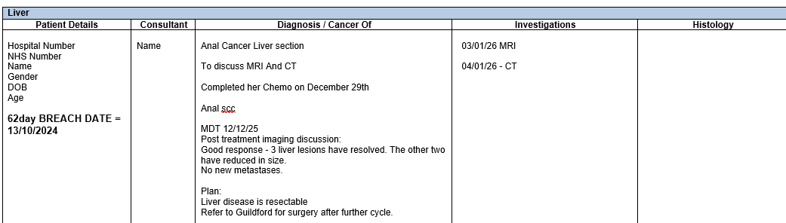

So this is the clinical problem: 

    We discuss patients with cancer in weekly meetings call multidisciplinary team meetings - MDTs. These consist of core members which cover the cancer treatment pathway, their initiation years ago have been one of the reasons cancer survival has been said to improve across the UK, other countries now adopt them.
    The process of creating these meetings is manual, patients are referred for discussion to an MDT co-ordinator who then collates a list of patients with their clinical histories, what treatment they have had so far, what the question for discussion is, what imaging and pathology needs discussion etc.
    This list is then circulated to everyone who goes to the meeting, we prepare for it. Radiologists look at the scans in light of the question, pathologists look at the slides etc. We all then come together and discuss the patient and the MDT decides what treatment the patient should have.
    This is recorded on a database called infoflex (there are different ones in different hospitals), the patient is treated as per the decision and then will be discussed again.
    The problem is - this data collection is inconsistent, and it is very difficult to get the data out of infoflex in any meaningful way if you want to get a group of patients with a specific cancer type etc together to audit or do research. 

A lot of people therefore keep manual databases of patients they treat etc. This as you can imagine is laborious. I'd love to say we could fix infoflex but thats unrealistic. 

So a more mobile solution is required, every cancer type has different treatment options, different things we'd want to record. For all MDTs they will want the staging and the TNM stage. 

I have tried to build databases but they require manual data input. @Charmaine Davies can share our last attempt. 

So, could we do something different? Utilise the MDT lists and outcome sheets that get circulated as word documents as a way of inputting into a database which could then be searched? 

Across the NHS there are researchers laboriously looking through notes to find out what has happened to patients and improve care, can you help? 

As you know I can't share patient data but below are snapshots of what data looks like on MDT lists and outcomes.

## Example MDT List:

## Example Outcomes:

